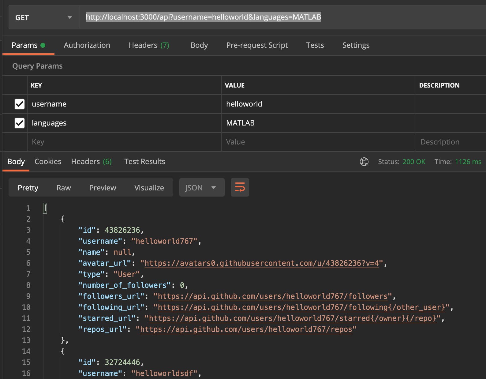

# Project Details:

## Description

This Project was scaffolded using [Nest](https://github.com/nestjs/nest) framework TypeScript starter repository. More project description to be added ...

## Normal Build and Run

### Install Node Modules
```
npm install
```

### Start Server 
```
npm run start:dev
```

### Now you can call the api endpoint
```
http://localhost:3000/api?username=helloworld&languages=python,java
```
The above is Get API. The parameter details is as following: 

**username**: search query for user / **languages**: programming language to filter search query



### Build the Docker Image

```bash
docker build -t reach-now-task .
```
### Start Docker Daemon client
Please start your Docker Daemon client in your machine. Make sure you have logined to docker client and have access to the docker resources.

### Run the image

```
docker run -p 3000:3000 reach-now-task
```
## Check in the Browser
 http://localhost:3000/ 

## Test

```bash
# e2e tests
$ npm run test:e2e

# test coverage
$ npm run test:cov
```

## Support

Nest is an MIT-licensed open source project. It can grow thanks to the sponsors and support by the amazing backers. If you'd like to join them, please [read more here](https://docs.nestjs.com/support).

## Stay in touch

- Author - [Kamil Myśliwiec](https://kamilmysliwiec.com)
- Website - [https://nestjs.com](https://nestjs.com/)
- Twitter - [@nestframework](https://twitter.com/nestframework)

## License

  Nest is [MIT licensed](LICENSE).
